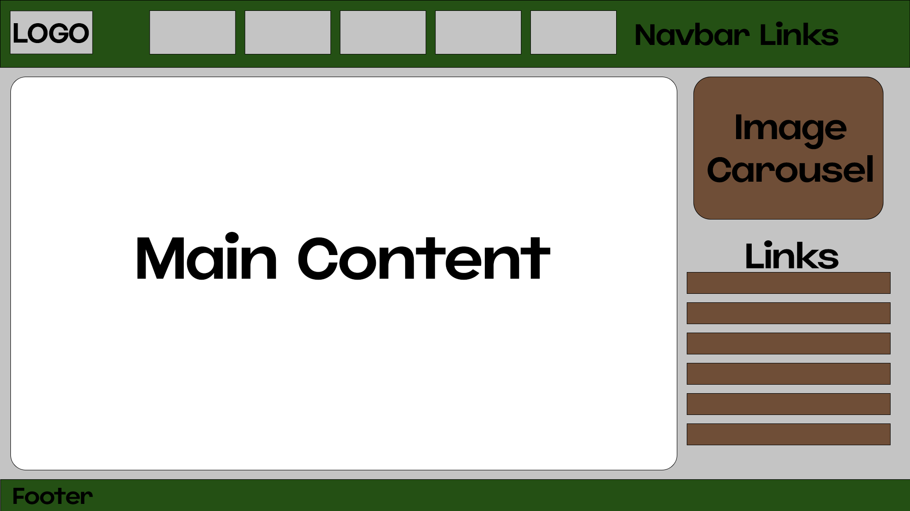
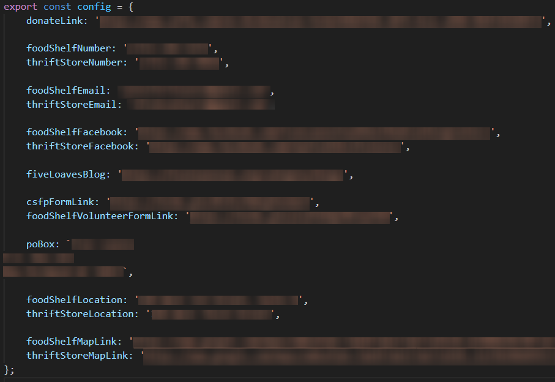

# Five Loaves Website

## Overview
This repository contains the source code for the Five Loaves website, a non-profit food shelf and thrift store dedicated to providing essential services to their local community. The website is designed to be mobile-responsive and user-friendly, ensuring that all visitors, regardless of their technical skill level, can navigate and obtain the information they need!

## Features
- **Mobile-Responsive Design**: Ensures the website is accessible from any device, especially phones.
- **Easy Navigation**: Simple layout to help users find information quickly and easily.
- **Fast Load Times**: With compressed WebP images and minified CSS, the website loads quickly across various internet speeds.
- **Contact/Location Information**: Directly connect with Five Loaves for inquiries, with locations for their businesses.
- **Service Listings**: Detailed descriptions of the food shelf and thrift store services provided by the organization.
- **News Page**: Preview of blog-posts fetched from the Word Press API hosted on the website.

## Technologies
- **HTML**
- **CSS**
- **JQuery** - Very familiar and simple framework.
- **Bootstrap** - Chosen for its ease of use and responsive design, helping to make the website more accessible.

## Development
Since I was redesigning a website, I took a look at the old one (which was just a very basic and dot-com era wix site) and asked some administrators what they thought were the most important features of the website. One of the conclusions I came to was that it's more likely users will be viewing the site from mobile devices, rather than desktops, which led me to use bootstrap for a lot of my design. This allowed me to work on the desktop version at the same time as the mobile version, with only minor tweaks with media queries being needed to keep them both looking great.
One of my original thoughts was to use an animation library and make things have some flair to them, but I decided to keep it simple as to not crowd the website with unnecessary features, as that might also raise the load times for users who may not have the best internet connections.

I started with an image editing program before I even got into the programming side of things. I figured that I'd only really need a consistent header and footer, but the main content would differ between pages.

I was also thinking heavily about future-proofing information on the website should something need to be changed by someone who may not be as knowledgable about web development. I opted for a config.js file that would hold important values that can be imported from utility.js (which will loop through IDs and such to set text and attributes based on the values of the config file!)
The image below is blurred as I don't want to share the non-profit's (possibly) private details on github.

